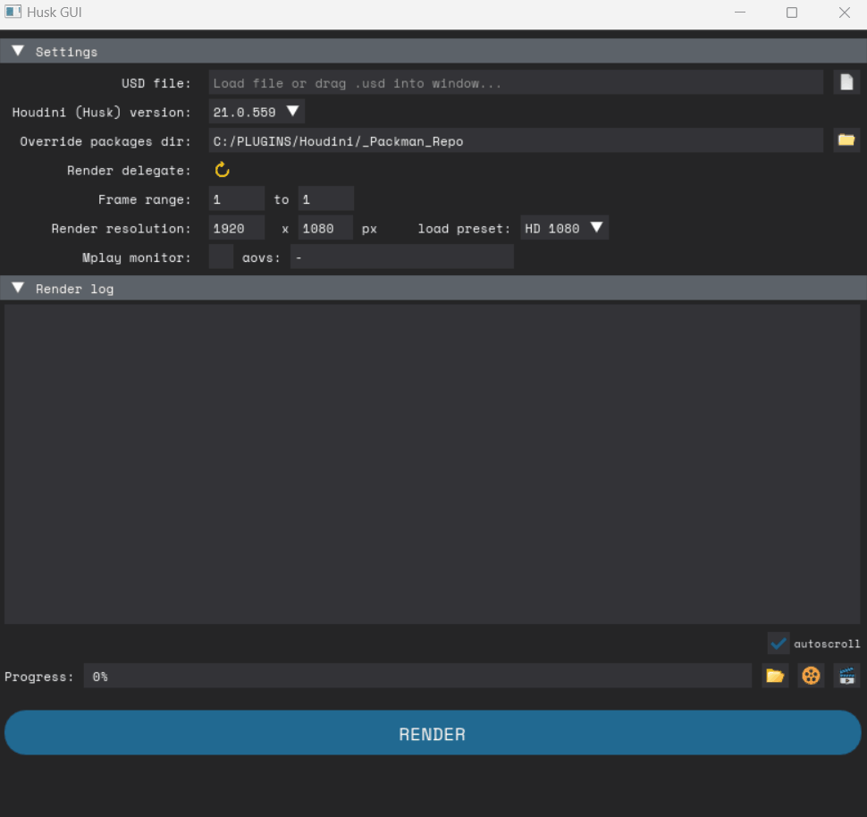

# husk-gui
A graphical interface for Houdini's HUSK program.

Download binaries [here](https://github.com/fabriciochamon/husk-gui/releases)

## Basic usage

1- Load a .usd file by dragging it to the window (or by using the file browser). It will take a few seconds to inspect the file and load the render resolution / frame range.

2- Once loaded, select the desired Houdini version to use husk from, in Houdini version combo.

3- If no render delegates are shown, press the yellow "reload" icon, it will fetch available renders from your chosen Houdini version, pick one.

4- Optionally override frame range or resolution from file.

5- Press "Render"

## Render delegates

Depending on which plugin packages are loaded with your desired Houdini version, different render delegates might be available, hence the reload icon. 

Also, there might be cases where you override the packages dir altogether, for example in the case of using custom launchers (like [Packman](https://github.com/fabriciochamon/Packman)). In this case you might want to use the "Override packages dir" input.

(btw, if Packman is found on your system, it will automaticaly populate the "Override packages dir" field with your repo folder!)

## Other utilities/tools

Once a render is finished, you can use the icons to the right of the progress bar:

- folder icon: open render outoput folder
- film roll icon: open rendered frames in mplay
- clapperboard icon: create video from render, optionally ctrl+click to open video output folder if you want to copy/paste/send to someone elese. (assumes render output is .exr, ACEScg, and that you have "ffmpeg" installed and available on path)

Mplay Monitor: if you want to see frames while rendering, check "Mplay monitor". Set a comma separated list of AOVs you want to watch, or leave "-" for all AOVs.

## Troubleshooting

Please make sure your .usd file is consistent and have proper render settings / render product defined. If you encounter any issues please log a ticket here on github.
 
